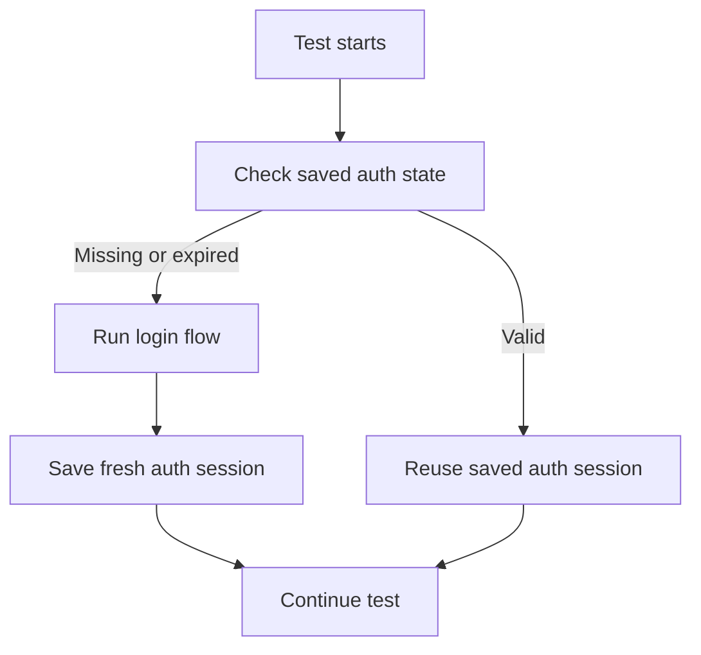
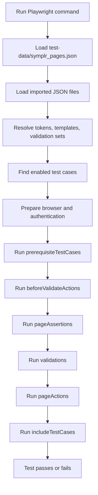
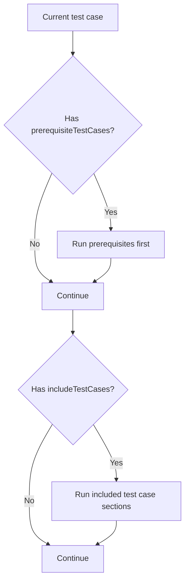
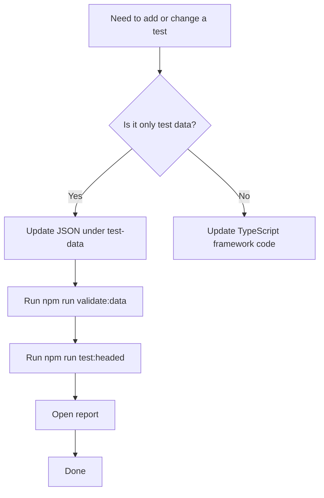

# Symplr Config-Driven Playwright Automation

This project is a **config-driven Playwright UI automation framework** for Symplr.

Instead of creating one `.spec.ts` file per business test case, most test behavior is described in JSON files under `test-data/`. The TypeScript framework reads that JSON and executes the configured flows, actions, validations, downloads, email checks, popup handling, and build/run flows.

---

## What this project is for

This framework can automate flows such as:

- user registration
- create app using template
- create app using Figma
- create app using prompt
- load existing app
- navigate dashboard screens such as Blueprint, Pages, Themes, Variables, Settings
- download app definition JSON
- validate email-based code delivery
- validate GitHub connection flows
- build and run the application
- validate QR code generation
- optionally delete an existing user through a super-admin API cleanup step before fresh-account flows

---

## Technology stack

- **Node.js**
- **Playwright**
- **TypeScript**
- **dotenv**
- **Gmail API** for email-based validations
- **JSON-driven test definitions**

---

## Local environment setup

### 1. Install Node.js

Recommended: **Node.js 20 or later**

Check if Node.js is already installed:

```bash
node -v
npm -v
```

Download from the official site:

```text
https://nodejs.org/
```

---

### 2. Install Git

Check if Git is already installed:

```bash
git --version
```

Download from:

```text
https://git-scm.com/
```

---

### 3. Install Visual Studio Code (recommended)

Download from:

```text
https://code.visualstudio.com/
```

Recommended extensions:

- Playwright Test for VS Code
- ESLint
- Prettier
- JSON support

---

## Project setup

### 1. Clone the repository or extract the ZIP

If using Git:

```bash
git clone <repository-url>
cd <project-folder>
```

If using a ZIP:

- extract the ZIP
- open a terminal in the extracted project folder

---

### 2. Install Node packages

```bash
npm install
```

---

### 3. Install Playwright browsers

```bash
npm run install:browsers
```

This runs:

```bash
npx playwright install
```

---

## Pre-requisites

Before running tests, make sure the following are available.

### Application access

- a working Symplr application URL
- a valid Google account that can sign in to the application
- valid test values such as:
  - app names
  - template names
  - Figma URL
  - email address for validations

### Email validation access

If you want to run tests that validate emails:

- a Gmail mailbox that can receive Symplr emails
- Gmail API access configured
- `secrets/credentials.json`
- `secrets/token.json`

### GitHub validation access

If you want to run GitHub-related tests:

- a GitHub account
- target repository access
- the application under test must be able to connect to GitHub

### Super-admin cleanup access

If you want to run test cases that delete a user account before a fresh-account flow:

- the target platform must expose the required super-admin APIs
- you must know the super-admin username and password
- the super-admin credentials must be added to `.env`
- you may optionally store the target user email in `tokens.json` or pass it directly in the action

> Note: the framework currently provides the action hook and placeholder method body with TODOs. You can plug in the actual API calls later without changing the JSON usage pattern.

### Figma validation access

If you want to run Figma-related tests:

- a valid Figma URL
- a Google account that can authenticate with Figma if required

---

## Environment variables

Create a `.env` file in the project root.

You can start from `.env.example`.

### Linux / macOS

```bash
cp .env.example .env
```

### Windows PowerShell

```powershell
Copy-Item .env.example .env
```

### Example `.env`

```env
APP_URL=https://101studio.co/
GOOGLE_EMAIL=test.user@example.com
GOOGLE_PASSWORD=your-password
EMAIL_SENDER=notification@example.com
GMAIL_CREDENTIALS_PATH=secrets/credentials.json
GMAIL_TOKEN_PATH=secrets/token.json

# Optional values for Figma popup authentication flows
FIGMA_GOOGLE_EMAIL=figma.user@example.com
FIGMA_GOOGLE_PASSWORD=your-figma-password

# Optional values for super-admin cleanup API flow
SUPER_ADMIN_USERNAME=super.admin@example.com
SUPER_ADMIN_PASSWORD=your-super-admin-password
```

### Important variables

- `APP_URL` — base URL of the application under test
- `GOOGLE_EMAIL` — Google login email used by the framework
- `GOOGLE_PASSWORD` — Google password used by the framework
- `EMAIL_SENDER` — expected sender email used in email-based checks
- `GMAIL_CREDENTIALS_PATH` — Gmail API credentials file path
- `GMAIL_TOKEN_PATH` — Gmail API token path
- `FIGMA_GOOGLE_EMAIL`, `FIGMA_GOOGLE_PASSWORD` — optional Figma-related login values
- `SUPER_ADMIN_USERNAME`, `SUPER_ADMIN_PASSWORD` — optional credentials used by the super-admin user cleanup action

---

## Gmail API setup for email validation

This is only required if you run email-related test cases.

### Step 1: Create a Google Cloud project

Enable the **Gmail API** for that project.

### Step 2: Create OAuth credentials

Download the OAuth client credentials JSON file and save it as:

```text
secrets/credentials.json
```

### Step 3: Generate the Gmail token

Run:

```bash
npm run gmail:auth
```

This will open the Gmail OAuth flow and create:

```text
secrets/token.json
```

### Step 4: Confirm `.env` paths

```env
GMAIL_CREDENTIALS_PATH=secrets/credentials.json
GMAIL_TOKEN_PATH=secrets/token.json
```

---

## Authentication behavior

This framework automatically handles login sessions.

### How it works

- if a saved auth session exists and is valid, the framework reuses it
- if the session is missing or expired, the framework automatically runs the login flow again

### Authentication flow



You normally do not need to log in manually before every test run.

---

## Project structure

```text
symplr_automation/
├── .env
├── .env.example
├── package.json
├── playwright.config.ts
├── tsconfig.json
├── eslint.config.mjs
├── .prettierrc.json
│
├── test-data/
│   ├── symplr_pages.json
│   ├── common/
│   │   ├── defaults.json
│   │   ├── tokens.json
│   │   ├── validation-templates.json
│   │   └── validation-sets.json
│   └── test-cases/
│       ├── home.json
│       ├── registration.json
│       ├── storyboard-navigation.json
│       ├── settings.json
│       ├── sharing.json
│       ├── download-code.json
│       ├── connect-to-figma.json
│       ├── connect-to-github.json
│       ├── build-run.json
│       └── e2e.json
│
├── tests/
│   ├── data-driven.spec.ts
│   ├── fixtures/
│   │   └── app-fixtures.ts
│   ├── utils/
│   │   └── auth-session.ts
│   └── data-driven/
│       ├── assertions.ts
│       ├── config.ts
│       ├── context.ts
│       ├── downloads.ts
│       ├── email-actions.ts
│       ├── locator-utils.ts
│       ├── models.ts
│       └── runner.ts
│
├── pages/
│   ├── AppRunPage.ts
│   ├── BuildRunPage.ts
│   ├── DashboardHomePage.ts
│   ├── DeveloperOptionsPanel.ts
│   ├── LoginPage.ts
│   ├── ProjectStoryBoardPage.ts
│   └── timeouts.ts
│
├── integrations/
│   └── email/
│       ├── GmailInbox.ts
│       └── GmailDownloadLink.ts
│
├── shared/
│   ├── framework-constants.json
│   └── test-data-loader.cjs
│
├── scripts/
│   ├── gmail-auth.mjs
│   ├── validate-test-data.mjs
│   └── test-data/
│       └── validator-helpers.mjs
│
├── schemas/
│   └── testCases.schema.json
│
└── secrets/
    ├── .gitkeep
    ├── credentials.json
    └── token.json
```

---

## What the important areas mean

### `test-data/`
This is the main place where users maintain test behavior.

- `test-data/symplr_pages.json` — master entry file that imports all JSON test data
- `test-data/common/defaults.json` — common defaults such as timeouts
- `test-data/common/tokens.json` — reusable values such as labels, app names, URLs
- `test-data/common/validation-templates.json` — reusable parameterized validation templates
- `test-data/common/validation-sets.json` — reusable groups of validations
- `test-data/test-cases/*.json` — actual test cases

### `tests/data-driven/`
This is the execution engine for the JSON-driven framework.

- `config.ts` — loads and resolves all JSON config
- `runner.ts` — runs actions, validations, includes, and prerequisites
- `assertions.ts` — assertion execution
- `downloads.ts` — download-related handling
- `email-actions.ts` — email-related handling
- `locator-utils.ts` — locator building from JSON
- `context.ts` — stores current runtime state
- `models.ts` — TypeScript models

### `pages/`
Reusable page helpers for flows that are easier to manage in code.

### `integrations/email/`
Gmail helper code for email retrieval and email-download link validation.

---

## How tests are executed

The framework reads the JSON definitions and executes them through a generic Playwright runner.

### High-level flow



---

## Standard test execution commands

### Validate JSON test data

Always do this first after changing any JSON:

```bash
npm run validate:data
```

### Run all tests in headless mode

```bash
npm run test
```

### Run all tests in headed mode

```bash
npm run test:headed
```

### Run all tests in Playwright UI mode

```bash
npm run test:ui
```

### Open the HTML report

```bash
npm run report
```

---

## How to run the tests in `e2e.json`

Because the framework loads all JSON test cases into a single generic Playwright spec, the easiest way to run only the E2E cases is by filtering their test names.

The test cases in `test-data/test-cases/e2e.json` contain names such as:

- `Full End to End Test`
- `Fresh Account: End to End scenario test using template`
- `Fresh Account: End to End scenario test using Figma`
- `Fresh Account: End to End scenario test using prompt`
- `Existing Account: End to End scenario test using template`
- `Existing Account: End to End scenario test using existing app`
- `Existing Account: End to End scenario test using Figma`
- `Existing Account: End to End scenario test using prompt`

### Run all E2E tests in headless mode

```bash
npx playwright test tests/data-driven.spec.ts --grep "End to End|Full End to End Test"
```

### Run all E2E tests in headed mode

```bash
npx playwright test tests/data-driven.spec.ts --headed --grep "End to End|Full End to End Test"
```

### Run all E2E tests in Playwright UI mode

```bash
npx playwright test tests/data-driven.spec.ts --ui --grep "End to End|Full End to End Test"
```

### Run one specific E2E test case

Example:

```bash
npx playwright test tests/data-driven.spec.ts --headed --grep "Fresh Account: End to End scenario test using Figma"
```

---

## Recommended run flow for most users

```bash
npm run validate:data
npm run test:headed
npm run report
```

---

## Super-admin cleanup prerequisite feature

The framework now supports a reusable **super-admin cleanup** action that can be used before fresh-account test flows.

### Purpose
Use this feature when you want to:
- log in as a super admin through platform APIs
- search for an existing user account
- delete the account if it already exists
- ensure a fresh-account test starts from a clean state

### Important note
The current implementation is intentionally a **safe placeholder**:
- it reads credentials and target user information
- it logs the intended flow
- the actual API calls are left as TODOs for later implementation

This means you can start using the JSON contract now without changing the framework again when you add the real API calls.

### Where the code lives
The helper is implemented in:

```text
tests/data-driven/admin-actions.ts
```

The action is supported by the runner and schema, so you can call it from any JSON test case.

### Required environment variables
Add these to `.env` if you plan to use this feature:

```env
SUPER_ADMIN_USERNAME=super.admin@example.com
SUPER_ADMIN_PASSWORD=your-super-admin-password
```

### Supported action type
Use this action type inside `beforeValidateActions` or `pageActions`:

```json
{
  "type": "deleteUserIfExistsAsSuperAdmin",
  "name": "Delete the user if it already exists",
  "value": "user@example.com"
}
```

You can also pass the target user from an environment variable:

```json
{
  "type": "deleteUserIfExistsAsSuperAdmin",
  "name": "Delete the user if it already exists",
  "valueEnv": "GOOGLE_EMAIL"
}
```

Or from tokens:

```json
{
  "type": "deleteUserIfExistsAsSuperAdmin",
  "name": "Delete the fresh account by email if it already exists",
  "value": "${tokens.symplrUserEmail}"
}
```

### Example usage in a fresh-account E2E flow

```json
{
  "name": "Full End to End Test",
  "enabled": true,
  "beforeValidateActions": [
    {
      "type": "deleteUserIfExistsAsSuperAdmin",
      "name": "Delete the fresh account by email if it already exists",
      "value": "${tokens.symplrUserEmail}"
    }
  ]
}
```

### Recommended usage pattern
Use this action only for flows where you truly need a clean user state, such as:
- fresh registration tests
- first-time onboarding flows
- fresh-account E2E scenarios

Avoid using it in normal existing-user flows.

---

## How to add a new test case

### Step 1: Decide where to add it

Add new test cases under:

```text
test-data/test-cases/
```

Examples:

- home page behavior → `home.json`
- storyboard screen navigation → `storyboard-navigation.json`
- build and run → `build-run.json`
- end-to-end flows → `e2e.json`

If none fits, create a new JSON file and import it from `test-data/symplr_pages.json`.

---

### Step 2: Copy a similar existing test case

This is the safest method.

---

### Step 3: Give it a unique `name`

Example:

```json
{
  "name": "Open Reports screen from dashboard",
  "enabled": true
}
```

---

### Step 4: Add pre-requisites if needed

If your test needs an app first, use `prerequisiteTestCases`.

Example:

```json
"prerequisiteTestCases": [
  "Load existing app"
]
```

Or:

```json
"prerequisiteTestCases": [
  "Create app using template"
]
```

---

### Step 5: Add actions and validations

The most common sections are:

- `beforeValidateActions`
- `pageAssertions`
- `validations`
- `pageActions`
- `includeTestCases`
- `prerequisiteTestCases`

---

## Example: add a simple dashboard navigation test

```json
{
  "name": "Open Blueprint screen from dashboard",
  "enabled": true,
  "beforeValidateActions": [
    {
      "type": "click",
      "locator": {
        "strategy": "locator",
        "locator": "[data-testid^=\"nav-item-\"][aria-label=\"Blueprint\"]"
      }
    }
  ],
  "validations": [
    {
      "$ref": "blueprintScreen"
    }
  ],
  "prerequisiteTestCases": [
    "Load existing app"
  ]
}
```

What this does:
- loads an existing app first
- clicks the Blueprint dashboard option
- runs the reusable `blueprintScreen` validation set

---

## How to modify an existing test case

1. Open the relevant JSON file under `test-data/test-cases/`
2. Update the test case
3. Run:

```bash
npm run validate:data
npm run test:headed
```

4. Review the report:

```bash
npm run report
```

---

## How reuse works

Two main reuse mechanisms exist.

### `prerequisiteTestCases`
Run one or more test cases first as setup.

Example:

```json
"prerequisiteTestCases": [
  "Load existing app"
]
```

### `includeTestCases`
Reuse other test case sections inside the current test.

Example:

```json
"includeTestCases": [
  "Open Pages screen from dashboard"
]
```

### Reuse flow



---

## JSON attributes you will use most often

### `name`
Unique test case name.

### `enabled`
Controls whether the test runs.

```json
"enabled": true
```

### `auth`
Controls per-test authentication behavior.

Example:

```json
"auth": {
  "session": "none",
  "clearStorageState": true,
  "navigateToApp": true
}
```

Typical values:
- `session: "authenticated"` — use saved auth session
- `session: "none"` — use clean context without reusing app session

### `beforeValidateActions`
Actions to run before the main validations.

### `pageAssertions`
Assertions about page title or URL.

### `validations`
Main element-level checks.

### `pageActions`
Actions to run after validations.

### `includeTestCases`
Reuse other configured test case logic.

### `prerequisiteTestCases`
Run setup test cases first.

---

## Supported locator strategies

The framework supports:

- `id`
- `role`
- `text`
- `label`
- `img`
- `placeholder`
- `altText`
- `title`
- `testId`
- `css`
- `xpath`
- `locator`
- `custom`

### Example: role locator

```json
{
  "strategy": "role",
  "role": "button",
  "name": "Continue",
  "exact": true
}
```

### Example: text locator

```json
{
  "strategy": "text",
  "text": "Width",
  "exact": true
}
```

### Example: locator string

```json
{
  "strategy": "locator",
  "locator": "div[role=\"button\"][data-id^=\"screen:\"]"
}
```

### Example: iframe locator

```json
{
  "strategy": "locator",
  "locator": "button",
  "frameLocator": "#my-iframe"
}
```

---

## Supported action types

Common supported action types include:

- `click`
- `fill`
- `check`
- `uncheck`
- `hover`
- `press`
- `selectOption`
- `download`
- `clickAndSwitchToPopup`
- `switchToPopupPage`
- `waitForTimeout`
- `waitForLoadState`
- `downloadAppDefinition`
- `downloadCodeEmail`
- `connectToGitHubEmail`
- `fillEmailCodeAndSubmit`
- `conditional`
- `buildAndRunApp`
- `waitForBuildComplete`
- `openRunOnDeviceModal`
- `waitForQrCodeGenerated`
- `switchToMainPage`
- `switchToRunPage`
- `deleteUserIfExistsAsSuperAdmin`

### Example: click

```json
{
  "type": "click",
  "locator": {
    "strategy": "role",
    "role": "button",
    "name": "Continue"
  }
}
```

### Example: fill

```json
{
  "type": "fill",
  "locator": {
    "strategy": "label",
    "text": "Email"
  },
  "valueEnv": "GOOGLE_EMAIL"
}
```

### Example: fixed wait

```json
{
  "type": "waitForTimeout",
  "timeout": 5000
}
```

Use this only when there is no stable UI signal.

### Example: super-admin user cleanup

```json
{
  "type": "deleteUserIfExistsAsSuperAdmin",
  "name": "Delete the user if it already exists",
  "value": "${tokens.symplrUserEmail}"
}
```

Current behavior:
- reads `SUPER_ADMIN_USERNAME` and `SUPER_ADMIN_PASSWORD` from `.env`
- reads the target user value from `value` or `valueEnv`
- logs TODO steps for the future API implementation

### Example: popup flow

```json
{
  "type": "clickAndSwitchToPopup",
  "locator": {
    "strategy": "role",
    "role": "button",
    "name": "Continue with Google"
  }
}
```

---

## Supported assertion types

The framework supports:

- `visible`
- `hidden`
- `attached`
- `enabled`
- `disabled`
- `editable`
- `checked`
- `unchecked`
- `empty`
- `textEquals`
- `textContains`
- `valueEquals`
- `attributeEquals`
- `countEquals`
- `countGreaterThan`
- `classContains`
- `cssEquals`
- `titleEquals`
- `titleContains`
- `urlEquals`
- `urlContains`

### Example: visible

```json
{
  "type": "visible"
}
```

### Example: textContains

```json
{
  "type": "textContains",
  "expected": "Build"
}
```

### Example: valueEquals

```json
{
  "type": "valueEquals",
  "expected": "0.81.4"
}
```

---

## Validation templates and validation sets

### Validation templates
Use a validation template when the same validation pattern is used repeatedly with different parameters.

Example usage:

```json
{
  "$template": "textIsVisible",
  "params": {
    "text": "Settings"
  }
}
```

### Validation sets
Use a validation set when a whole group of checks is reused often.

Example usage:

```json
{
  "$ref": "settingsScreen"
}
```

### Recommendation
- use **templates** for repeated patterns
- use **validation sets** for repeated screen-level groups of validations

---

## Best practices

### Prefer tokens for reusable values
Store repeated values in:

```text
test-data/common/tokens.json
```

### Prefer validation sets for repeated screen checks
Store repeated validation groups in:

```text
test-data/common/validation-sets.json
```

### Avoid duplicated JSON
Before adding a new test, check whether:
- a similar test already exists
- the validation already exists as a validation set
- the pattern already exists as a validation template

### Prefer stable locators
Best locator preference order:
1. `role`
2. `label`
3. `testId`
4. `id`
5. `locator` / clear CSS selector
6. XPath only if unavoidable

### Avoid hard sleeps if possible
Prefer:
- `visible`
- `enabled`
- `urlContains`
- `waitForLoadState`
- `postValidations`

Use `waitForTimeout` only when there is no reliable state to wait for.

---

## Troubleshooting

### JSON validation fails
Run:

```bash
npm run validate:data
```

Then fix the field shown in the error.

### Test fails during login
Check:
- `.env`
- `GOOGLE_EMAIL`
- `GOOGLE_PASSWORD`
- `APP_URL`

Run in headed mode:

```bash
npm run test:headed
```

### Email tests fail
Check:
- `EMAIL_SENDER`
- Gmail credentials and token
- Gmail authorization setup

Then run:

```bash
npm run gmail:auth
```

### Locator no longer works
Update the locator in the correct JSON file:
- token
- validation set
- validation template
- or test case directly

### Test needs another flow to run first
Use:

```json
"prerequisiteTestCases": [
  "Load existing app"
]
```

---

## Recommended maintenance workflow



---

## Quick reference

### Install dependencies

```bash
npm install
```

### Install browsers

```bash
npm run install:browsers
```

### Validate data

```bash
npm run validate:data
```

### Run all tests

```bash
npm run test
```

### Run all tests visibly

```bash
npm run test:headed
```

### Run all tests in Playwright UI mode

```bash
npm run test:ui
```

### Run E2E tests only in headless mode

```bash
npx playwright test tests/data-driven.spec.ts --grep "End to End|Full End to End Test"
```

### Run E2E tests only in headed mode

```bash
npx playwright test tests/data-driven.spec.ts --headed --grep "End to End|Full End to End Test"
```

### Run E2E tests only in UI mode

```bash
npx playwright test tests/data-driven.spec.ts --ui --grep "End to End|Full End to End Test"
```

### Open report

```bash
npm run report
```

### Gmail auth

```bash
npm run gmail:auth
```

---

## Final note

For most users:

- change **JSON files** when changing what to test
- change **TypeScript files** only when changing how the framework works

That separation is the main strength of this project.
